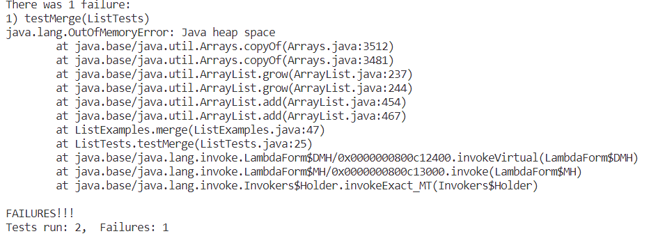

Part 1

**Part 2**
1. In ListExample, method filter, the failure inducing input is:
    ```
    @Test
    public void testFilteris(){
        String[] contents = {"apple", "banana", "cheery", "dragon fruit", "eggplant"};
	    List<String> agl = Arrays.asList(contents);
	    String[] result = {"banana", "cheery", "dragon fruit", "eggplant"};
	    agl = ListExamples.filter(agl, new lengthLongerThan5());
	    assertArrayEquals(result, agl.toArray());
    }
    ```
     the symptom is an Out of Memory Error
     
     the bug is:
     ```
     while(index2 < list2.size()) {
      result.add(list2.get(index2));
      index1 += 1;
      ```
      Since it says increase index1 instead of index2, the condition of the while loop will always be met, and it becomes an infinite loop.
      Thus, it goes out of memory.

2. In ArrayList, method reversedInPlace, the failure input is:<br/>
    ```
    @Test
    public void testReverseInPlace2(){
    int[] input1 = { 3, 2 };
    ArrayExamples.reverseInPlace(input1);
    assertArrayEquals(new int[]{ 2, 3 }, input1);
  }
  ```
  the symptom: returns {2,2} when {2,3} is expected
  the bug is:
  ```
  for(int i = 0; i < arr.length; i += 1) {
      arr[i] = arr[arr.length - i - 1];
    }
    ```
    The code above changes the original data in arr so we will get the same number for the first half and the last half.
