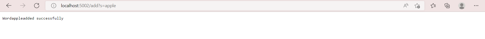
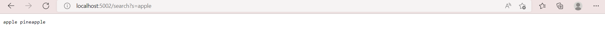

## Lab Report 2
**Part 1**
Below is my code:
```
import java.io.IOException;
import java.net.URI;
import java.util.ArrayList;

class SearchEngineHandler implements URLHandler {
    ArrayList <String> items = new ArrayList <String>();

   
    public String handleRequest(URI url) {
        if(url.getPath().equals("/")){
            return  "Let's start!";
        }

        else if (url.getPath().contains("/add")) {
            String[] parameters = url.getQuery().split("=");
           // if (parameters[0].equals("s")){
                items.add(parameters[1]);
           // } 
               return "Word"+ parameters[1] +"added successfully";
        }
        else {
            System.out.println("Path: " + url.getPath());

            if (url.getPath().contains("/search")){
                String[] search = url.getQuery().split("=");
                if (search[0].equals("s")){
                    String searchReturn = ""; 
                    for(String x: items){
                        if(x.contains(search[1])){
                            searchReturn += x;
                            searchReturn += " and ";
                        }
                    }
                    return searchReturn;
                }
            }
            return "404 Not Found!";
        }
        
    }

}

class SearchEngine {
    public static void main(String[] args) throws IOException {
        if(args.length == 0){
            System.out.println("Missing port number! Try any number between 1024 to 49151");
            return;
        }

        int port = Integer.parseInt(args[0]);

        Server.start(port, new Handler());
    }
}
```

* Method called: handleRequest
* Values of the relevant arguments: localhost:5002
* Values of relevant fields of the class: Nothing is changed in this method. We only open up the webpage.


* Method called: handleRequest
* Values of the relevant arguments:  localhost:5002/add?s=apple
* Values of relevant fields of the class: ArrayList items = [apple]
* Change: when handleRequest is called, "apple" is added to Arraylist items.


* Method called: handleRequest
* Values of the relevant arguments: localhost:5002/search?s=app
* Values of relevant fields of the class: <br/>
ArrayList items = [apple, pineapple]. ArrayList output = [apple, pineapple]
* Change: when handleRequest is called, we loop through ArrayList items to see if there is a word containing "app" the query.


**Part 2**
1. In ListExample, method filter, the failure inducing input is:<br/>
    ```
    @Test
    public void testFilteris(){
        String[] contents = {"apple", "banana", "cheery", "dragon fruit", "eggplant"};
	List<String> agl = Arrays.asList(contents);
	String[] result = {"banana", "cheery", "dragon fruit", "eggplant"};
	agl = ListExamples.filter(agl, new lengthLongerThan5());
	assertArrayEquals(result, agl.toArray());
    }
    ```
    the symptom is an Out of Memory Error<br/>
    
    the bug is:<br/>
    ```
    while(index2 < list2.size()) {
    	result.add(list2.get(index2));
      	index1 += 1;
    ```
    Since it says increase index1 instead of index2, the condition of the while loop will always be met, and it becomes an infinite loop.<br/>
    Thus, it goes out of memory.<br/>

2. In ArrayList, method reversedInPlace, the failure input is:<br/>
    ```
    @Test
    public void testReverseInPlace2(){
    int[] input1 = { 3, 2 };
    ArrayExamples.reverseInPlace(input1);
    assertArrayEquals(new int[]{ 2, 3 }, input1);
    }
    ```
    the symptom: returns {2,2} when {2,3} is expected<br/>
    the bug is:<br/>
    ```
    for(int i = 0; i < arr.length; i += 1) {
      arr[i] = arr[arr.length - i - 1];
    }
    ```
    The code above changes the original data in arr so we will get the same number for the first half and the last half.<br/>
