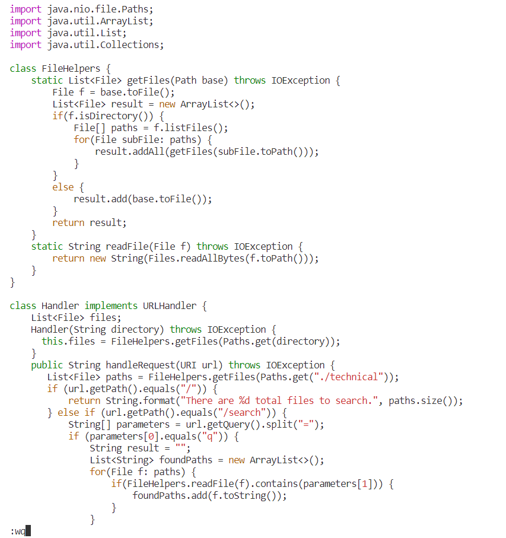

## Lab Report 4
**Part 1**

The task I pick is the first task: 
Changing the name of the start parameter and its uses to base"
from [ week 6.](https://ucsd-cse15l-f22.github.io/week/week6)  

The shortest code in my group is from Rui Li and Yunfei Yang:  

`vim<space>D<tab><enter>/start<enter>cebase<esc>n.n.:wq<enter>` 
* When I type `vim<space>D<tab><enter>`, I get into vim of DocSearchServer.java

* When I type `/start<enter>`, the curser jumped to the first "start" in the file.

* When I type `cebase<esc>`, I delete the whole word of "start" using ce and enter insert mode. Then I type in base and enter normal mode.

* When I type `n.n.:wq`, I repeated the previous action and then save and leave the file.

**Part 2**

1. It took me 1 minute and 52 seconds to change the code from 10 to 1391 in TestDocSearch.java and test it on my friend's computer because my windows computer cannot run bash. 
   I am very not familiar with her computer so it take me some time.  
2. It took me 1 minute and 7 seconds to do the same on remote (mainly because I have always been doing that because windows cannot run bash).   

* I prefer the first style if I have a mac right now, because I am more familiar with that, and I am not familiar enough with vim so I don't know who to undo changes and stuff, and it would take some time if I look them up. 
* However, I will definitely prefer vim after I learn how to efficiently navigate and use vim codes because it will save me from downloading the file to my computer.  

* I think it would be nice to use the first method if I write my code on my computer, and then try to move it to the remote.  However, if the projects exists online or on the remote, I will use vim instead of downloading those files to my computer and then scp them to remote because it is a lot of work.  I will definitely not do that if the files are huge or if I need to use something only remote computer has.
