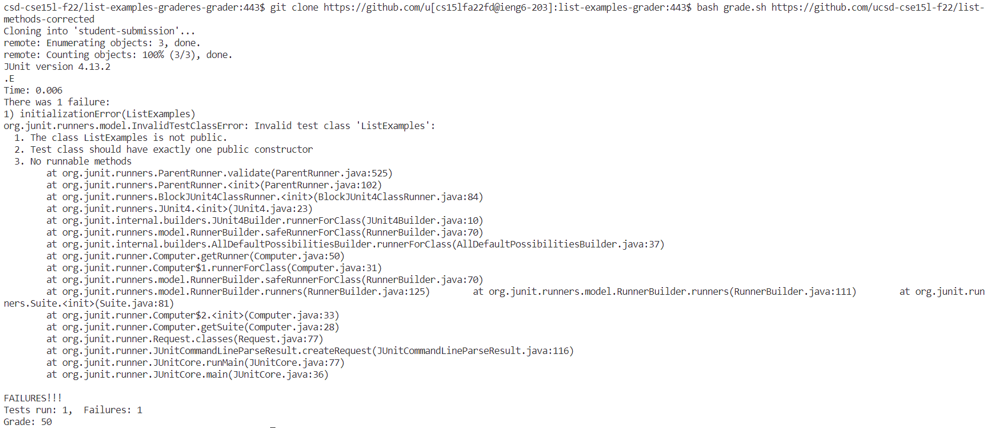
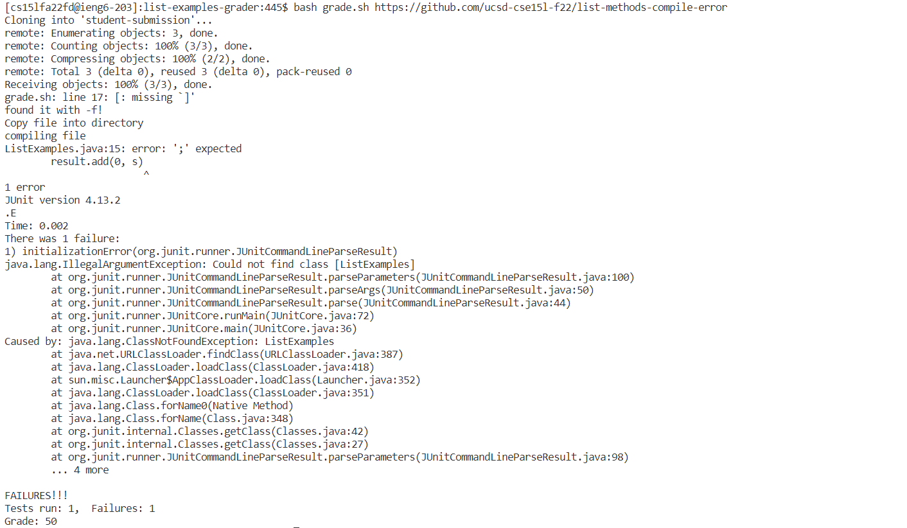
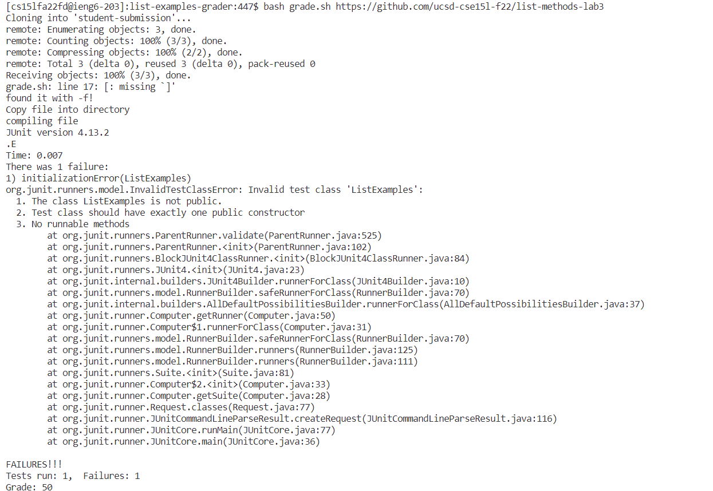

Code:
```
#set -e

# Grading Script viariables
CP=".:lib/hamcrest-core-1.3.jar:lib/junit-4.13.2.jar"

SCORE=0
ERROR=0
TESTS=2

# Clean up repo
rm -rf student-submission

# Clone student repo
git clone $1 student-submission
if [ $? -ne 0]; then
        echo"Clone unsuccessful!"
        exit 1
fi

# Check if ListExamples.java exists
if [ -f "student-submission/ListExamples.java" ]; then
  echo "found it with -f!"
else
  echo "file not found"
  exit 1
fi

# Copy test file into directory
cp TestListExamples.java student-submission/
echo "Copy file into directory"
mkdir student-submission/lib
cp lib/* student-submission/lib
cp *.java student-submission

# Go into the directory
cd student-submission/

# Compile student code
echo "compiling file"
javac -cp $CP *.java
java -cp $CP org.junit.runner.JUnitCore ListExamples > results.txt

#Grade
if [ $? -eq 0 ]; then
    SCORE=100
else
    echo "$(<results.txt)"

    # I learn to use head and tail and how to get the scores from the person for lab 9.
    # aphuanh004

    cat results.txt | head -n 2 | tail -n 1 > grading.txt
    ERROR=$(grep -o 'E' grading.txt | wc -l | xargs)
    SCORE=$(( 100 - ($ERROR * 100 / $TESTS) ))
fi

# Print the student's grade
echo "Grade: $SCORE"
```
I have trouble with opening the webpage in "http://ieng6-203.ucsd.edu:4001". <br/>
I think it is because that I am not using school Wifi, but I am in TEXAS right now so I cannot.<br/>
I also cannot run it on a local host because I have a windows computer, so it is not working for me.<br/>
The following are those running on the terminal instead of the server.<br/>



